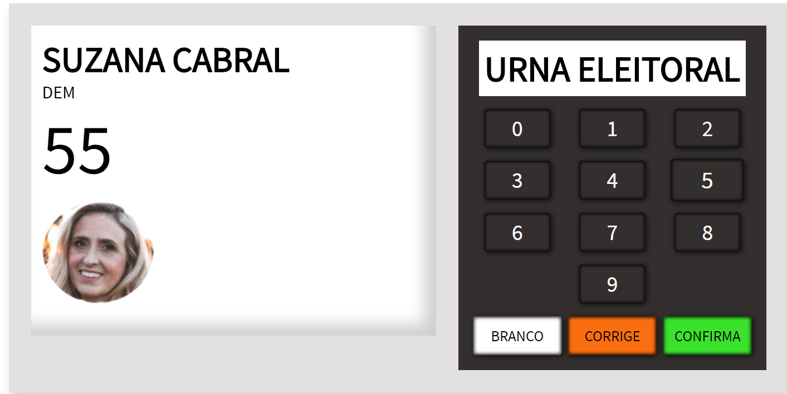

# :brazil: Urna Eleitoral

:fire:Projeto de Urna Eletrônica empreendido através de: 

- HTML 
- CSS 
- JAVASCRIPT 
- SASS 
- BEM CSS 

- [x] Não use Frameworks ou Bibliotecas 
- [x] Aproprie-se de grid/flex css 
- [x] Use a sintaxe BEM
- [x] Renderize os botões através do JavaScript
- [x] Componha a folha de estilo com SASS, organizado
- [x] Introduza animações
- [x] Faça a urna funcionar, adequando a foto do candidato fictício e informações dele
- [x] Aprenda algo

*make with :heart:*

